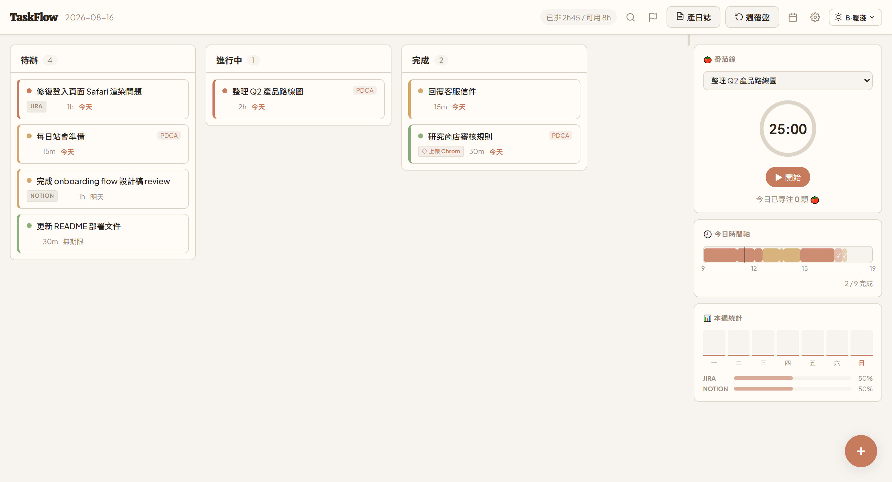
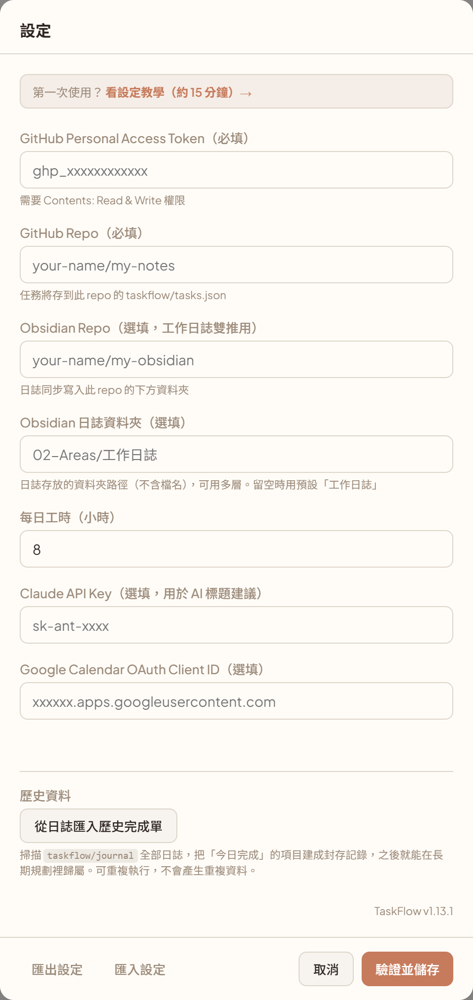
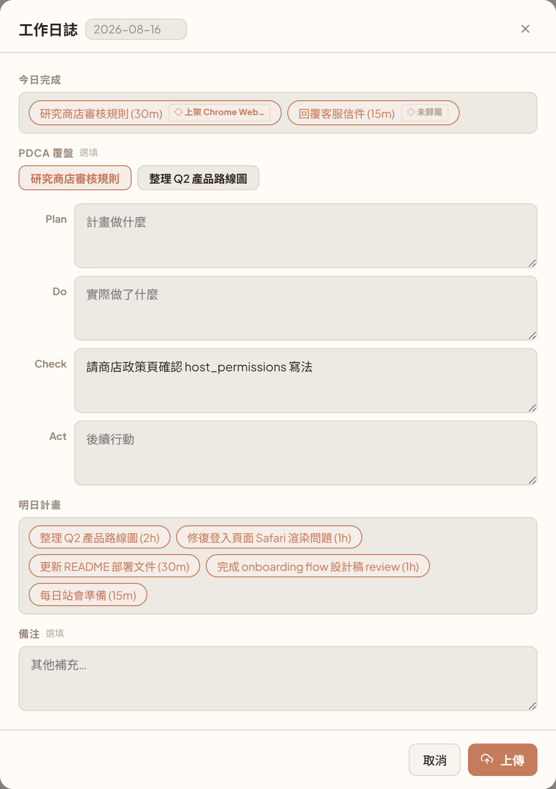
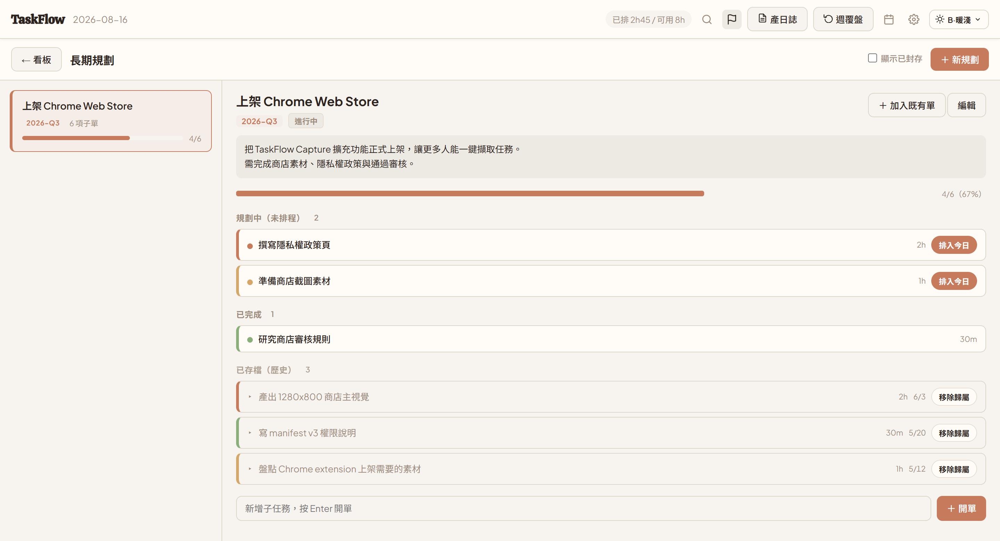

# TaskFlow

一個人用的工作管理網頁。看板管今天要做什麼、PDCA 記下每張單的思考、收工一鍵產出當天的工作日誌，資料全部存在**你自己的 GitHub repo**。

**[→ 開啟 App](https://bryan47nice.github.io/taskflow/)**



<sub>畫面為範例資料</sub>

---

## 這是什麼、適合誰

市面上的任務工具大多在解「事情有沒有做完」。TaskFlow 想解的是另外三件事：

**一、做完之後有沒有留下東西。** 每張單都有 Plan / Do / Check / Act 四欄。不是要你每張都寫滿，而是遇到「這次踩到坑了」「下次要換做法」的時候有地方放。收工產日誌時，這些內容會自動變成當天的覆盤段落。

**二、你到底排得完排不完。** 頂列那個「已排 2h45 / 可用 8h」不是把八小時直接給你——它會看你**最近三天實際完成 vs 當初預估**的比例來打折。連續三天高估自己，可用工時就會自動縮水。這叫「誠實工時」，用來擋住早上排十件、晚上完成三件的循環。

**三、每天的碎單跟長期目標的關係。** 一張單可以歸到某個「長期規劃」底下（類似 Jira 的 Epic）。做了三個月的專案，底下所有已完成的單都留著、進度條會動，日誌也會依規劃分組，不會只剩一堆看不出脈絡的流水帳。

**不適合誰**：要多人協作、指派任務給別人、跑 sprint 的，請用 Jira 或 Linear。TaskFlow 是單人工具，沒有帳號系統、沒有權限、沒有共享。

---

## 你的資料放在哪

**沒有伺服器。** App 是一包純靜態 HTML/CSS/JS，掛在 GitHub Pages 上。你的任務跟日誌不會經過任何第三方——瀏覽器直接呼叫 GitHub API，寫進你指定的 repo。

所以第一步是給它一個 repo。它會在裡面建這些檔案：

```
你的 repo/
└── taskflow/
    ├── tasks.json                       目前看板上的任務
    ├── plans.json                       長期規劃（母單）
    ├── archive/
    │   └── 2026.json                    已寫進日誌的完成單，按年分片
    ├── journal/
    │   ├── 2026-08-15.md                每日工作日誌
    │   └── 2026-08-16.md
    └── weekly/
        └── 2026-08-10_2026-08-16.md     週覆盤
```

`taskflow/` 以外的東西它完全不碰，所以可以直接用你現有的筆記 repo，不用另外開一個。

如果你有在用 Obsidian，可以再設定一個「Obsidian repo」，日誌會**同時**寫一份到那邊你指定的資料夾，在 Obsidian 裡直接讀。

你的 PAT 和 API key 存在**瀏覽器的 localStorage**，只留在你這台機器上，不會上傳到任何地方（包括那個 repo）。

---

## 第一次設定（約 15 分鐘）

### Step 1 — 開一個 private repo

到 [github.com/new](https://github.com/new)：

- **Repository name**：隨便取，例如 `my-notes`
- **Visibility**：選 **Private** ⚠️
- 勾 **Add a README file**（建議，讓 repo 有一個初始 commit）
- 按 Create repository

**為什麼一定要 private**：你的工作日誌會寫進這個 repo，裡面會有專案名稱、Jira 連結、同事名字、內部討論。開 public 等於把工作內容公開上網。這一步選錯之後很難補救（GitHub 有快取、可能被爬），所以請確認一次。

已經有筆記 repo 的話跳過這步，直接用那個——但同樣先確認它是 private。

### Step 2 — 建一個 fine-grained PAT

PAT（Personal Access Token）是讓 App 代表你讀寫那個 repo 的鑰匙。**用 fine-grained 而不是 classic**，因為 classic token 一旦外流等於你整個 GitHub 帳號。

到 [Settings → Developer settings → Personal access tokens → Fine-grained tokens](https://github.com/settings/personal-access-tokens/new)，逐項這樣填：

| 欄位 | 填什麼 |
|---|---|
| **Token name** | `taskflow` |
| **Expiration** | 90 days（到期再換一次即可；選 No expiration 風險太大） |
| **Resource owner** | 你自己的帳號 |
| **Repository access** | 選 **Only select repositories** → 下拉選 Step 1 那個 repo |
| **Repository permissions** | 找到 **Contents**，改成 **Read and write** |

**Repository permissions 底下其他幾十項全部保持 No access。** TaskFlow 只需要 Contents 這一項，多給的每一項都是外流時的額外損失。

按 Generate token，畫面會顯示一串 `github_pat_...` 開頭的字串。**這串只會出現這一次**，先複製起來。

### Step 3 — 填進 App

開 [TaskFlow](https://bryan47nice.github.io/taskflow/)。沒設定過的話，設定視窗會自動跳出來。



| 欄位 | 填什麼 |
|---|---|
| **GitHub Personal Access Token** | 剛剛複製的那串 |
| **GitHub Repo** | `你的帳號/repo名稱`，例如 `your-name/my-notes`。注意是 `owner/repo` 格式，不是完整網址（貼網址進去也會自動幫你去掉 `https://github.com/`） |
| **每日工時** | 你一天實際能做事的時數，預設 8。有很多會議的話填低一點會準一些 |

按 **驗證並儲存**。它會實際打一次 API 確認連得上，成功才會存。

**驗證失敗的三個常見原因：**

1. **repo 名稱打錯** — 大小寫要完全一致，格式是 `owner/repo` 不是 `github.com/owner/repo`
2. **PAT 沒給對 repo** — fine-grained token 是綁定特定 repo 的，Step 2 選錯 repo 就會連不上
3. **權限只有 Read** — Contents 要是 **Read and write**，只有 Read 存得進去但寫不回來

改完 token 要重新 Generate 一次，改權限不會回溯套用到已發出的 token。

### Step 4 — Obsidian 雙推（選填）

有在用 Obsidian、而且 vault 有推到 GitHub 的話：

| 欄位 | 填什麼 |
|---|---|
| **Obsidian Repo** | vault 的 repo，例如 `your-name/my-obsidian`。可以跟上面同一個 |
| **Obsidian 日誌資料夾** | 日誌要放的資料夾路徑，例如 `02-Areas/工作日誌`。可以多層，留空的話用預設「工作日誌」 |

設了之後，每份日誌會同時寫進 `taskflow/journal/` 跟這個資料夾。週覆盤則會放到該資料夾下的 `週報/` 子資料夾。

⚠️ PAT 也要有這個 repo 的 Contents: Read and write 權限。兩個 repo 不同的話，Step 2 的 Repository access 要兩個都選。

### Step 5 — AI 標題與行事曆（選填）

| 欄位 | 用途 |
|---|---|
| **Claude API Key** | 新增任務時自動把一段雜亂文字濃縮成 15 字內的標題。到 [console.anthropic.com](https://console.anthropic.com/) 申請，走 Haiku，用量很小 |
| **Google Calendar OAuth Client ID** | 顯示今天的行事曆，並把會議時間從可用工時裡扣掉。設定流程見 [PRD](docs/PRD.md) |

兩個都不填也能正常用。

### 換裝置怎麼辦

設定存在 localStorage，**不跨瀏覽器也不跨裝置**。換一台就要重填一次。

省事的做法：在設定頁按 **匯出設定** 下載一個 JSON，到新裝置按 **匯入設定** 讀進來，再按驗證並儲存。

⚠️ 那個 JSON 裡的 PAT 是明文，用完就刪掉，不要丟進雲端硬碟或聊天室。

---

## 一天怎麼用

```
早上  ──  ＋ 進單（Triage 四步）
          └→ 看頂列「已排 / 可用」決定今天排幾張
                    │
白天  ──  拖到「進行中」→ 番茄鐘計時 → 隨手補 PDCA 的 Do / Check
                    │
                    └→ 做完拖到「完成」
                    │
收工  ──  按「產日誌」→ 檢查內容 → 上傳
          └→ 完成欄的單會被封存並清空，明天從乾淨的看板開始
                    │
週五  ──  按「週覆盤」→ 自動彙整整週 → 寫反思 → 上傳
```

### 進單：Triage 四步

右下角 ＋（或 Chrome 擴充功能的 Alt+S）開 Triage，四步：**名稱 → 優先級 → 預估時間 → 截止日**。

預估時間的選項是 15m / 30m / 1h / 2h / 3h / 4h+。刻意做成選項而不是自由填，是因為「精確估時」本身就是浪費時間——抓個級距就好，反正誠實工時會用實際完成率幫你校正。

### 排今天：看誠實工時

頂列會顯示「已排 X / 可用 Y」。算法是：

```
可用工時 = （每日工時 − 今天的會議時間）× 折扣
折扣    = 近三天「實際完成分鐘 ÷ 當初預估分鐘」的加權平均
          （最近一天 ×3、前一天 ×2、再前一天 ×1，下限 0.3、上限 1.0）
```

資料不滿三天不打折。所以剛開始用的頭幾天它會很樂觀，用一週之後才會開始準。

排到超過可用工時它會提示超出多少，但不會擋你——決定權在你，它只負責讓你知道自己在做什麼。

### 暫時不做的單：擱置區

待辦欄塞太多會失焦。用不到的單一鍵「擱置」，收進右側面板的一張可收合小卡，不佔看板、不計入工時。桌面版也可以直接把卡片拖過去。

### 收工：產日誌



按「產日誌」會開一個編輯器，把今天的東西整理好給你確認：

- **今日完成** — 完成欄的所有單，依所屬規劃分組。每張單後面有 ◇ 徽章顯示歸屬，**沒歸屬的會標成「◇ 未歸屬」，點一下就能當場歸進某個規劃**（這是最後機會——上傳後這些單就轉成封存記錄離開看板了）
- **PDCA 覆盤** — 有填過 PDCA 的單各一個頁籤，可以在這裡補完
- **明日計畫** — 進行中 + 今天沒做完的待辦
- **備注** — 自由欄位

確認後按上傳。產出的 markdown 長這樣：

```markdown
# 2026-08-16 工作日誌

## 今日完成

### ◇ 風向優化
- [x] 調整後端計算邏輯 (15m)

### 未歸屬
- [x] 處理庫存需補的情境 (30m)

## PDCA 覆盤

### 調整後端計算邏輯
**所屬規劃**：風向優化
**Check**：發現是 prompt 可再調整，程式面沒問題
**Act**：現在 prompt 過長，要看精簡會不會犧牲品質

## 明日計畫
- [ ] 整理 Remote Config 文件 (30m)
```

**上傳後完成欄會被清空**——那些單會轉成封存記錄存進 `archive/`，不是刪掉。它們仍然計入長期規劃的進度，也還能在規劃頁看到。這是為了讓明天的看板從乾淨的狀態開始。

日期可以自己選，補產昨天的日誌沒問題。同一天重複上傳會先跳確認，不會靜默覆蓋。

### 週五：週覆盤

按「週覆盤」，它會去抓這週每一天的日誌，自動彙整成「本週完成總覽」和「PDCA 彙總」，你只要補「本週反思」和「下週重點」。下週重點會自動帶入目前待辦清單當草稿。

---

## 長期規劃



頂列的旗幟圖示進入規劃頁。一個「規劃」就是一個長期目標（類似 Jira 的 Epic），底下掛一堆單。

**三種方式把單歸進去：**

- **從看板**：卡片上有個 ◇ 徽章（沒歸屬的單滑過去才會浮現），點一下彈出快選
- **從規劃**：規劃詳情頁的「＋ 加入既有單」，可以搜尋、多選，一次把看板上的單跟已完成的歷史單勾進來
- **從日誌編輯器**：產日誌時每張完成單都帶 ◇ 徽章，漏歸屬的會標成「◇ 未歸屬」，點一下就地補（v1.14.0 起）

**子單清單分四組**：規劃中（未排程）／進行中／已完成／已存檔（歷史）。前三組是還在看板上的單，第四組是已經寫進日誌、封存起來的。點歷史列可以就地展開當天的日誌全文。

**進度條**把歷史單一起算進去，所以做了三個月的規劃會顯示真實累積進度，而不是只算還沒做完的那幾張。

**「規劃中（未排程）」是刻意設計的**：在規劃底下開的新子單預設是這個狀態，不會出現在今日看板、不計入誠實工時。需要做的時候按「排入今日」才進入日常流程。這樣長期規劃可以先想清楚步驟，但不會污染今天的待辦。

**日誌會依規劃分組**（v1.13.0 起），所以「這週推進了哪個規劃」在日誌上看得出來。

> 💡 如果你在這個功能上線前就已經用了一陣子，舊日誌裡的完成單不在封存檔裡。設定頁有個 **從日誌匯入歷史完成單**，掃一次全部日誌把它們補建成封存記錄，之後就能歸屬到規劃。可重複執行，不會產生重複資料。

---

## 其他功能

| 功能 | 說明 |
|---|---|
| **搜尋（Ctrl+F）** | 同時搜目前看板上的卡片和近 5 天的日誌內容 |
| **番茄鐘** | 25 分鐘計時，綁定某張任務，記錄今日專注顆數 |
| **收工提醒** | 工作日 18:00 提醒你產日誌，19:00 後還沒產會跳視窗；漏掉的話隔天跳橫幅提醒補產（自動避開週末與台灣假日） |
| **Google 行事曆** | 顯示今日會議，並從可用工時扣掉會議時間 |
| **AI 標題建議** | 貼一段雜亂文字，Claude Haiku 幫你濃縮成 15 字內的任務標題 |
| **主題** | 兩套配色 × 明暗，共四種 |
| **手機版** | RWD，三欄變頁籤，卡片左右滑動切換狀態 |

### Chrome 擴充功能（選用）

在任何網頁選取文字按 `Alt+S`，直接開 Triage 新增任務，來源網址會一起帶進去。Google Chat 的 @mention 訊息還會自動長出「加入 TaskFlow」按鈕。

安裝（未上架商店，要手動載入）：

1. 下載這個 repo（Code → Download ZIP，解壓縮）
2. 開 `chrome://extensions/`，右上角開啟「開發人員模式」
3. 按「載入未封裝項目」，選 `chrome-extension/` 資料夾

---

## 安全須知

這幾件事值得花兩分鐘看：

**1. 資料 repo 一定要 private。** 工作日誌裡會有專案名稱、Jira 連結、同事名字、內部討論。這是最容易出事、也最難補救的一項。

**2. PAT 用 fine-grained，只給 Contents: Read and write，只綁需要的 repo。** classic token 是全帳號權限，外流的損失完全不同量級。設個 90 天效期，到期換一次。

**3. 匯出的設定檔含明文 PAT。** 換裝置用完就刪掉，不要丟雲端硬碟或聊天室。

**4. 別在公用電腦或別人的瀏覽器上登入。** PAT 存在 localStorage，沒有登出按鈕，清除的方式是清瀏覽器資料。真的用了，記得回 GitHub 把那個 token revoke 掉。

**5. App 是純前端。** 你的 PAT 只在你的瀏覽器跟 GitHub 之間傳遞，不經過任何中間伺服器——包括這個 App 的作者。想確認的話，原始碼全部在這個 repo 裡，`lib/github-api.js` 一百行不到。

---

## 疑難排解

**改了東西但 repo 沒更新**
存檔是 debounce 的，動作後約 1.2 秒才會寫，連續操作會合併成一次 API call。頂列右側的指示器會顯示「同步中…」→「已同步」，看到已同步才算寫進去。失敗會顯示「同步失敗」並跳 toast。

**跳「衝突，請重新整理」**
同一個 repo 在兩個分頁或兩台裝置同時改，GitHub 會擋下後寫的那次（409）。程式會自動重抓一次再試，還是失敗就重新整理頁面。避免的方法：不要同時開兩個分頁。

**日誌上傳成功，但顯示「封存失敗」**
日誌已經進 GitHub 了，但完成單沒轉成封存記錄，所以它們**還留在看板上**。這是刻意的——寧可你手動再處理一次，也不要讓成果憑空消失。通常是網路問題，等一下重新上傳即可（會問你要不要覆蓋，按確定）。

**日誌跑到 vault 裡奇怪的資料夾**
檢查設定頁的「Obsidian 日誌資料夾」。這一格留空的話會用預設值「工作日誌」（v1.13.0 起）。填完整路徑並儲存，再把跑錯的檔案搬回去就好。

**不小心覆蓋了日誌**
GitHub 有完整的檔案歷史。到 repo 找到那個 `.md`，點 History 就能看到並還原前一版。

**手機上看不到規劃徽章**
◇ 徽章在桌面版是滑過卡片才浮現，手機版則是常駐低透明度。歸屬過的單會直接顯示規劃名稱。

**想從頭來過**
清掉瀏覽器對這個網站的 localStorage 就會回到初始狀態。repo 裡的資料不受影響，重新填設定就會讀回來。

---

## 開發者

| 面向 | 決策 |
|------|------|
| 前端 | 純 HTML/CSS/JS，無框架、無 build step |
| 儲存 | GitHub Contents API（PAT 認證） |
| 部署 | GitHub Pages |
| AI | Claude API（Haiku） |
| 行事曆 | Google Calendar API + GIS OAuth2 |
| 擴充功能 | Chrome MV3 Service Worker |

本機開發：

```bash
node serve.js
```

跑起來在 `localhost:3456`，會自動注入 `mock-mode.js`——完全繞過 GitHub API，用 localStorage 的假資料，不用設 PAT 就能改 UI。

- [CHANGELOG](CHANGELOG.md) — 版本紀錄
- [PRD](docs/PRD.md) — 產品需求文件
- [ROADMAP](docs/ROADMAP.md) — 功能規劃
- [docs/superpowers/](docs/superpowers/) — 各功能的設計文件
